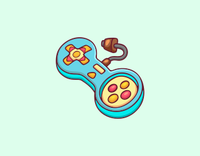

### Author: @Jonas-sebera

# gamer-dao
Build a gamer DAO on the Q Blockchain

# About

### Our contract adds members to a DAO , remove and do some validations for the interest of voting in order to achieve monitoring.

 ## We will create :

 #### A native DAO token
 #### Build DAO using Q DAO Factory
 #### Add AirDrop Module to your DAO

## We will:
#### Be able to claim an airdrop
#### create members
#### Be able to give out voting power
#### Be able to provide governance to our DAO
#### Vote for a specific arguement 

### It does actually the full functionalities of a professional DAO

 ### Index
 It will perform  the basic functionality of a proffesional DAO.

 It is just develop as the interest to use different tools as many as possible as practice is recorgnized too.

### @Jonas-sebera
